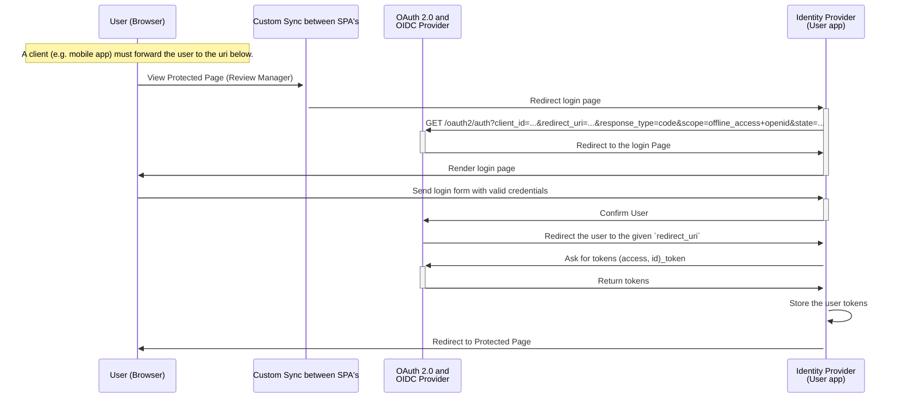

# How to save a user with devise and warden

Devise and Warden are two gems which are working together in order to manange a user session.

## Warden
Warden is a gem which can validate user input and can decide if a user should be stored in a session or not.

## Devise
Adds some nice tooling around the simple password validation and user store. This can be counting the login attemds or whihc IP was used for the current sign_in

## Session layers
In our authentication setup we use a Authorization Server in our case an OpenID Provider named Hydra.
This Authorization Server knowns which users are authenticated. By design of OpenID we need next to the Authorization Server an Authentication Server. In our case this is our user App. This server will validates if the credentials provided by the user are correct or not.

### Application Session Layer
Your application knows if a given user is logged in our not

### Authorization Server Session Layer
Hydra knows if a given user is is logged in our not. The application needs to ask in order to get this information.

### Identity Provider Session Layer
In our case the Identity Provider is our user app.

## Authentication flow

